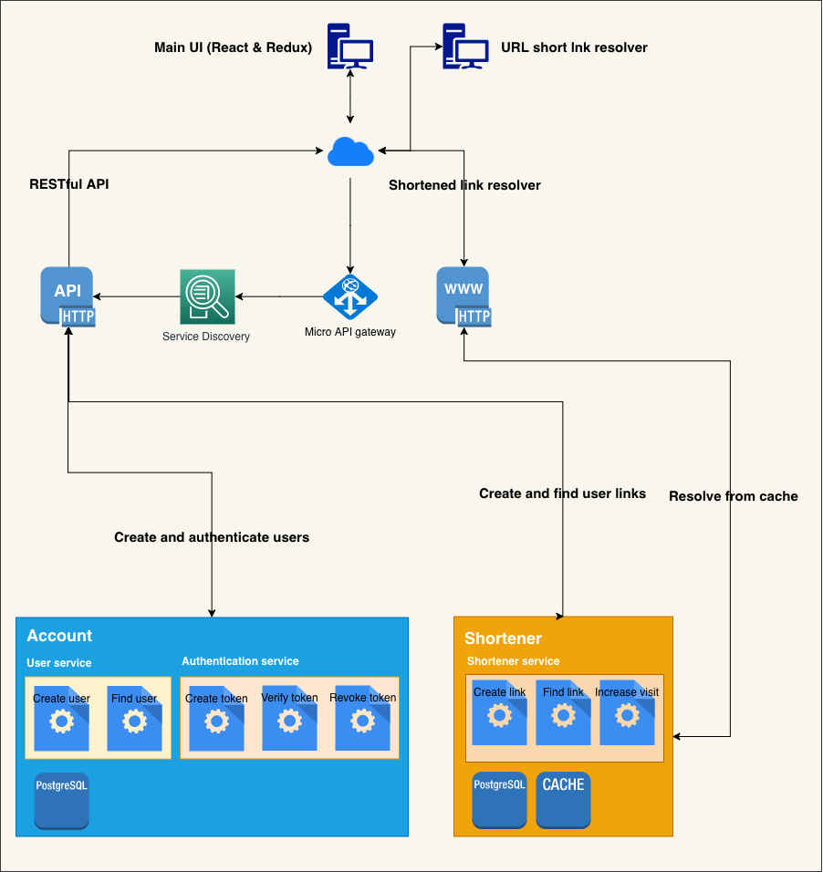

# Cortito

- [Cortito](#cortito)
  - [Description](#description)
    - [Common package](#common-package)
    - [Account service](#account-service)
    - [Shortener service](#shortener-service)
    - [API](#api)
    - [Web endpoint](#web-endpoint)
    - [Frontend](#frontend)
    - [Running](#running)
    - [TODO](#todo)

## Description

This is a simple URL shortener created using microservices.

There are two simple micro services using [Go Micro](https://github.com/micro/go-micro). All microservices use Protocol Buffers for communication.
The services are exposed using an API gateway also using [Micro API](https://micro.mu).



### Common package

All services use common functionality like database access, connection to other services, reading configuration, etc.

The [`common`](./common/) package contains these functionality to avoid code duplication.

### Account service

The [`account`](./account/) service handles users and authentication. It exposes functions to create, update and authenticate a user.
Password can be generated using BCrypt or Argon2. This can be changed in the configuration file.

### Shortener service

The [`shortener`](./shortener/) service is responsible for creating and resolving shortened links. These links are
created per-user, but everyone can follow the link.

### API

The [`api`](./api/) interfaces with the services through a single endpoint. The Micro API gateway is responsible for selecting the node each
request is going to be handled by. This is useful in a multi-node environment.

### Web endpoint

The [`web`](./web/) endpoint is responsible for resolving shortened URLs and redirect the user to the actual URL.
When somebody hits a shortened link the visit for that link is increased.

### Frontend

The [`frontend`](./frontend/) is a React application where users can sign up, create links and see the usage of a particular link.

### Running

The simplest way to run the application is using `docker-compose up`. This will bring up all services including the frontend and the link resolution component.

When using `docker-compose` the services are started using a modified version of the package called [dogo](https://github.com/liudng/dogo). The version used is modified to expand environment variables and ignore certain folders when recompiling.

1. **Install and run Consul**
```bash
$ brew install consul
$ consul agent -dev
```
2. **Start the main services**
```bash
$ cd ./account
$ MICRO_REGISTRY=consul MICRO_REGISTRY_ADDRESS=localhost:8500 dogo
$ cd ../shortener
$ MICRO_REGISTRY=consul MICRO_REGISTRY_ADDRESS=localhost:8500 dogo
```
3. **Install and start micro for the API gateway**
```bash
$ go get -u github.com/micro/micro
$ micro --version
$ MICRO_REGISTRY=consul MICRO_REGISTRY_ADDRESS=localhost:8500 api --handler=http --namespace=io.coderoso.cortito --resolver=micro
```
4. **Start the API service**
```bash
$ cd ./api
$ MICRO_REGISTRY=consul MICRO_REGISTRY_ADDRESS=localhost:8500 dogo
```
5. **Start the endpoint used to resolve shortened links**
```bash
$ cd ./web
$ MICRO_REGISTRY=consul MICRO_REGISTRY_ADDRESS=localhost:8500 dogo
```
5. **Finally start the user interface**
```bash
$ cd ./frontend
$ yarn start
```
**_NOTE_**: Each service has a configuration file where the port and hostname are specified. If you run into communication problems, check this settings as well as the `./frontend/.env` and `./frontend/jsconfig.json` files.

### TODO

- Add support for private links
- Generate shortened links using message queue.
- Add WebSockets to the frontend.
- Add information about the client following a link.
- Add command-line clients for services.
- ~~Add caching for the shortened links.~~
